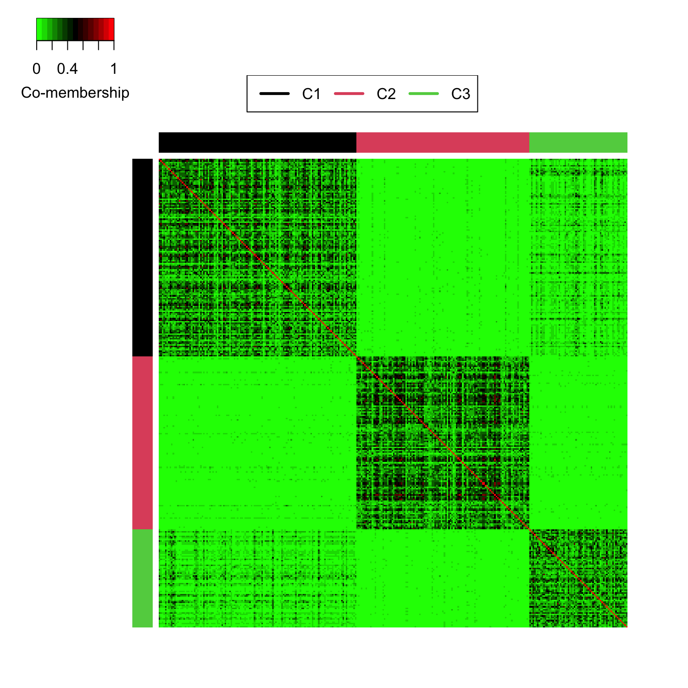

## MultiPhenoAssoc: Multivariate phenotype-gene association analysis


*MultiPhenoAssoc* is an R package for identifying genes associated with multiple disease phenotypes in transcriptomics studies.

## Description
*MultiPhenoAssoc* is an R package for identifying genes associated with multiple disease phenotypes in transcriptomics studies. *MultiPhenoAssoc* effectively aggregates heterogeneous phenotype-gene effects, allows association with different data types of phenotypes and performs selection of associated
phenotypes.

## Usage
```r
## expr, pheno, confounder are the gene expression, mulitple phenotypes, and confounder.
## The first three input parameters should be "matrix" with samples displayed in rows.
## Pheno.type is a k-value vector for indicating the types of outcome variables such as continuous, binary, count, and survival.
## Two methods proposed in papers ("AFp" and "AFz") can both be applied by the main function. 
AWFisher.MultiPheno(expr, pheno, confounder, Pheno.type,
                    method = c("AFp", "AFz"), num.bootstrap = 50,
                    num.perm = 100, ncores = 5)
```

## Installation
MultiPhenoAssoc v1.0.0 is now available in github
```r
library(devtools)
install_github("HungChingChang/MultiPhenoAssoc")
```

## Example
#### Perform multivariate phenotype-gene association analysis
```r
library(MultiPhenoAssoc)
data(exampleData)
Expr <- exampleData$Gene.expr
Pheno <- exampleData$Pheno
Confounder <- exampleData$Confounder
Pheno.type <- c("continuous", "count", "binary", "survival")
AFp.pvalue <- AWFisher.MultiPheno(expr = Expr,
                                  pheno = Pheno,
                                  confounder = Confounder,
                                  Pheno.type = Pheno.type,
                                  method = "AFp",
                                  num.bootstrap = 10,
                                  ncores = 5)
```

#### Prepare distance matrix for tight clustering
```r
load("Distance.matrix.AFp.Rdata")
AFp.BH <- p.adjust(AFp.pvalue, "BH") # Benjamini-Hochberg correlation
sig.gene.index <- which(AFp.BH < 0.01) # set 0.01 as threshold to select significant genes
Distance.matrix <- 1 - Distance.matrix.AFp[sig.gene.index, sig.gene.index]
colnames(Distance.matrix) <- rownames(Distance.matrix) <- rep("",dim(Distance.matrix)[1])
```

#### Tight clustering
```r
res <- tight.clust(Distance.matrix, 3, 10, random.seed=12345)
set1.index <- which(res$cluster==1)
set2.index <- which(res$cluster==2)
set3.index <- which(res$cluster==3)
tight.cluster.gene <- c(set1.index, set2.index, set3.index)
colors <- rep(as.character(1:3),
              c(length(set1.index), length(set2.index), length(set3.index)))
tight.cluster.distance.matrix <- Distance.matrix[tight.cluster.gene, tight.cluster.gene]

library(gplots)
heatmap.2(1-tight.cluster.distance.matrix,
          trace = "none", col="greenred", Rowv = NULL, dendrogram = "none",
          Colv=NULL, RowSideColors = colors, ColSideColors = colors,
          density.info = "none", key.title = NA, key.xlab = "Co-membership", key.ylab = NA,
          keysize=1, key.par = list(cex=1))
legend("top", legend = paste0("C",1:3),
       col = as.character(1:3),
       cex=1, lty=1, lwd=3, horiz = T)
```



## License
This software is licensed under MIT.
